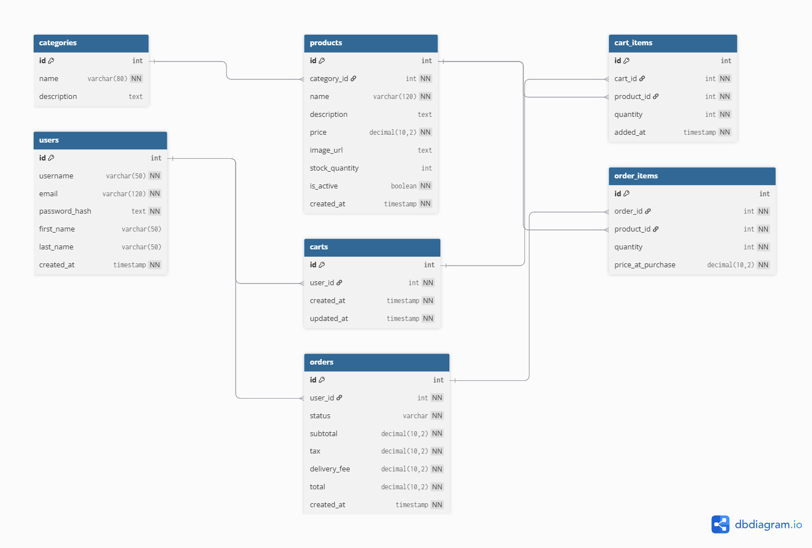

# Fozorewor Mart Capstone  Project Pitch

Fozorewor Mart is an online grocery shopping platform built to deliver a fast, convenient, and reliable digital shopping experience.

## Overview

This web-based application allows users to:

- Browse grocery products
- Manage shopping carts
- Place customer orders

The goal is to make grocery shopping simpler while supporting efficient order processing and delivery management.

## Objective

Develop a scalable, user-centric platform that:

- Simplifies grocery shopping
- Improves customer convenience
- Supports efficient order fulfillment
- Creates a strong foundation for future growth

## Core Features

- Secure user registration and login
- Product browsing by category
- Keyword-based product search
- Cart management with quantity updates before checkout
- Order placement with pricing details such as subtotal, tax, and delivery fee
- Order history and order status tracking

## Future Enhancements

- Product reviews for verified purchases
- Inventory tracking with real-time stock updates
- Admin dashboard for managing products and orders
- Favorites and "buy again" recommendations
- Secure payment integration for complete checkout

## Expected Outcome

The platform is expected to provide a scalable and efficient solution that:

- Enhances user convenience
- Improves shopping reliability
- Supports long-term platform expansion

## Database Schema

The database for this project includes:

- `users`
- `categories`
- `products`
- `carts`
- `cart_items`
- `orders`
- `order_items`

This schema supports product browsing, cart management, order history, and viewing the details of a single order.

## ER Diagram

[View DBML Schema](backend/db/schema.dbml)
